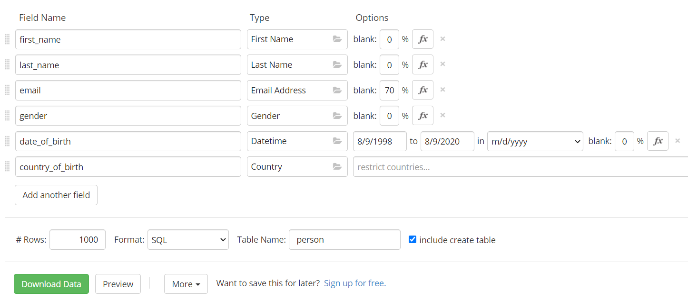
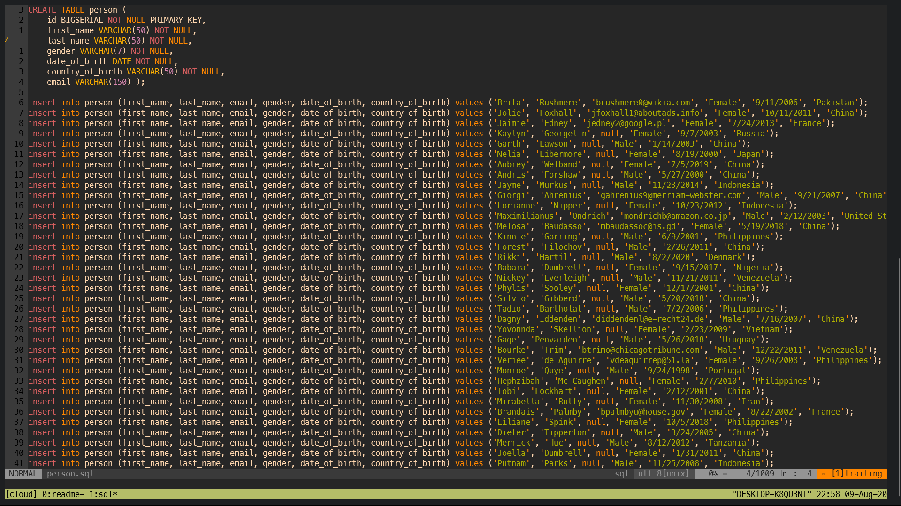

# PostgreSQL cheatsheet

## **Contents**
---
* [Installation on Linux](#installation-on-linux)
* [Create, Connect & Change Database](#Create,-Connect-&-Change-Database)
* [Create table](#Create-table)
* [Insert](#insert)
* [Import .sql file](#import-.sql-file)
* [Generating dummy data using Mockaroo](#generating-dummy-data-using-mockaroo)
* [Query](#query)
    * [WHERE & AND](#where-&-and)
    * [ORDER BY](#order-by)
    * [DISTINCT](#distinct)
    * [Comparison Operators](#comparison-operators)
    * [IN](#in)
    * [BETWEEN](#between)
    * [LIKE & ILIKE](#like-&-ilike)
    * [GROUP BY](#group-by)
    * [GROUP BY HAVING](#group-by-having)
    * [Aggregate Functions](#aggregate-functions)
* [UPDATE](#update)
* [DELETE](#delete)
* [Arithmatic Operators](#arithmetic-operators)
* [Adding Primary Key](#adding-primary-key)
* [Adding UNIQUE Constraint](#adding-unique-constraint)
* [CHECK Constraint](#check-constraint)
* [ON CONFLICT](#on-conflict)
* [Adding Relationships between tables](#adding-relationships-between-tables)
* [UPDATE Foreign keys column](#update-foreign-keys-column)
* [DELETE Records with foreign keys](#delete-records-with-foreign-keys)
* [JOIN](#join)
    * [INNER JOIN](#inner-join)
    * [LEFT JOIN](#left-join)
* [EXTENSIONS](#extensions)
* [UUID](#uuid)
* [Serial & Sequences](#serial-&-sequences)
* [Timestamps & Dates](#timestamps-&-dates)
* [Age Function](#age-functions)
* [COALESCE](#coalesce)
* [NULLIF](#nullif)
* [Exporting Query Results to CSV](#exporting-query-results-to-cSV)


### ***Installation on Linux***
---
We'll use apt package manager to install PostgreSQL on Linux OS, 
```
    sudo apt install postgresql postgresql-contrib
```
For database status, start & stop,
```
    sudo service postgresql status
    sudo service postgresql start
    sudo service postgresql stop
```
Change the password before using for the first time, type `sudo passwd postgres` & you'll be prompt to insert a password.

Now, start the database server by typing `sudo service postresql start` and connect to the server typing `sudo -u posgres psql`.

Here 'postgres' is the username, which is the default username of PostgreSQL.

You'll be promt to give the password you set earlier.

You can type `\l` to get the list of the databases.

**If you are on Windows or Mac OS, installation procedure will be different but the commads are same across all platforms.**

**PostgreSQL syntax is case insensitive, but it is preferred to write them in uppercase letter.**

### **Create, Connect & Change Database**
---
To create a database,
```sql
    CREATE DATABASE db-name;
```
Now, in order to conncet to the database there are two ways.

First one is directly from terminal,
```
    psql -h hostname -p port-number -U username database-name
```
e.g., if you connect to a database named 'test', that is on your computer, 
```
    psql -h localhost -p 5432 -U postgres test
```
Second one is, if you are already in psql, simply type `\c database-name`.

### **Create Tables**
---
Syntax for creating table is,
```sql
    CREATE TABLE table_name (
        Column name + data type + constraints if any
    );
```
PostgreSQL supports various [data types](https://www.postgresql.org/docs/12/datatype.html).

Tables can be created with or without [constraints](https://www.tutorialspoint.com/sql/sql-constraints.htm).

*Example of creating table Without contraints,*
```sql
    CREATE TABLE person ( 
        id BIGSERIAL, 
        first_name VARCHAR(50) , 
        last_name VARCHAR(50) ,
        gender VARCHAR(7) ,
        date_of_birth DATE ,
        email VARCHAR(150) );
```
*Example of creating table With constraints,*
```sql
    CREATE TABLE person ( 
        id BIGSERIAL NOT NULL PRIMARY KEY, 
        first_name VARCHAR(50) NOT NULL, 
        last_name VARCHAR(50) NOT NULL,
        gender VARCHAR(7) NOT NULL,
        date_of_birth DATE NOT NULL,
        country_of_birth VARCHAR(50) NOT NULL,
        email VARCHAR(150) );
```
**Using constraints is considered best practice.**

*Type `\d` to see the tables in the database.*

*Type `\d person` to see the details of table named person.*

### **Insert**
---
Syntax for inserting data into table is,
```sql
    INSERT INTO table_name (
        col_name1,
        col_name2,
    )
    VALUES ('value_of_col_name1', 'value_of_col_name2);
```
*Example of data insertion in previously created table,*
```sql
    INSERT INTO person (first_name, last_name, gender, date_of_birth)
    VALUES ('John', 'Doe', 'male', date '1988-01-09');
```
***Since id is BIGSERIAL it'll increment auto itself. Date have to be inserted in YYYY-MM-DD format.***
### **Import .sql file**
---
If you have a .sql file that you want to import in your database,
```
    \i 'path/to/the/file/filename.sql';
```
### **Generate dummy data with Mockaroo**
---
[Mockaroo.com](https://mockaroo.com/) is simple to use website where 1000 rows with data can be generated for free.

Let's create 1000 records for our table 'person' and download it.


Change the table creation code with our previously written code and import it.

```
    \i '/mnt/c/Users/nafi/Desktop/person.sql'
```
### **Query**
---
```sql
    SELECT col_name FROM table_name;
```
Lets say we want to find find the first_name of every person in our table.
```sql
    SELECT first_name FROM person;
```
*`SELECT *` means select everythig.*

##### ***WHERE & AND***
In order to use a condition in data query, WHERE is used.

Let's say we want to find the record of every person whose country_of_birth is 'France'.
```sql
    SELECT * FROM person WHERE country_of_birth = 'France';
```